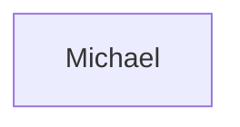
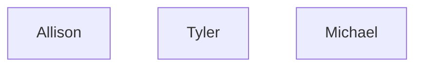
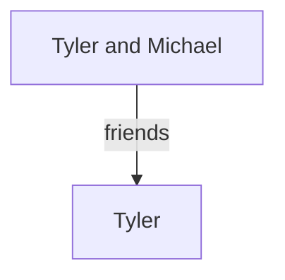

# Context Extraction System - Goals & Issues

## Goal

Automatically extract context from game video transcripts and save to markdown files for Obsidian with Graph View.

### Requirements

1. **Extract from transcript** - Use AI to extract characters, locations, key terms, relationships
2. **Save to markdown** - Save to `/home/alph4r1us/ShortsForge/Context/{game}/`
3. **Proper markdown format**:
   - Frontmatter with metadata
   - Tables with wiki-links `[[Name]]`
   - Mermaid diagrams for visualization
4. **No manual approval** - Auto-extract and save, user edits later in Obsidian
5. **Learn from corrections** - MemPalace integration for persistent memory

---

## Current Issues

### Issue 1: Mermaid Duplicate IDs

**Problem**: All nodes use same ID `A`, causing rendering issues:


**Expected**:


**Location in code**: `_rebuild_file_preserving_content()` around line 2522

**Fix applied** (not working):
```python
safe_id = f"{item_type[0].upper()}{i}"  # e.g., C0, L0, K0
```

---

### Issue 2: Self-Referential Relationships

**Problem**: AI returns relationships like "Michael and Michael are friends" or "[[Michael]] | friends | [[Michael]]"

**Current output**:
```
| [[Michael]] | friends | [[Michael]] |
| [[Tyler]] | friends | [[Tyler]] |
```

**Expected**: Skip or fix to show actual relationship

**Location**: `_rebuild_relationships_preserving_content()` parsing logic

---

### Issue 3: Malformed Relationship Parsing

**Problem**: AI returns messy formats:
- "Michael and Tyler are implied to know each other"
- "Allison and Allison are friends"
- "- | Tyler is a mentee of someone | -"

**Current table output**:
```
| Character A | Connection | Character B |
| - | Michael and Tyler are... | - |
| [[Allison]] | meeting after ten years | [[Allison]] |
```

**Expected**: Proper parsing with two distinct characters

---

### Issue 4: Mermaid Syntax Errors

**Problem**: Invalid Mermaid syntax:
```mermaid
graph TD
    A[Tyler and Michael] --|friends}|> 
```

**Expected**:


---

## Files Involved

- `/home/alph4r1us/ShortsForge/workflows/shortsforge.py` - Main application
  - `_cs_extract_context_from_transcript()` (line ~2836) - AI extraction
  - `_cs_save_context()` (line ~2224) - Save to markdown
  - `_rebuild_file_preserving_content()` (line ~2444) - Rebuild with Mermaid
  - `_rebuild_relationships_preserving_content()` (line ~2598) - Rebuild relationships

- `/home/alph4r1us/ShortsForge/workflows/context_manager.py` - Context verification

- `/home/alph4r1us/ShortsForge/Context/{game}/` - Output directory
  - `characters.md`
  - `locations.md`
  - `key_terms.md`
  - `relationships.md`

---

## Test Plan

1. Clear all context (markdown files, memory, MemPalace)
2. Run `/run_phase 2`
3. Check markdown files for:
   - Unique Mermaid node IDs (C0, C1, C2...)
   - No self-referential relationships
   - Proper table format
   - Valid Mermaid syntax
4. If issues persist, debug the save flow

---

## Questions for Future Investigation

1. Why isn't the code fix being applied? Is there caching?
2. Is the code being called from a different location?
3. Should we simplify the save logic to reduce bugs?